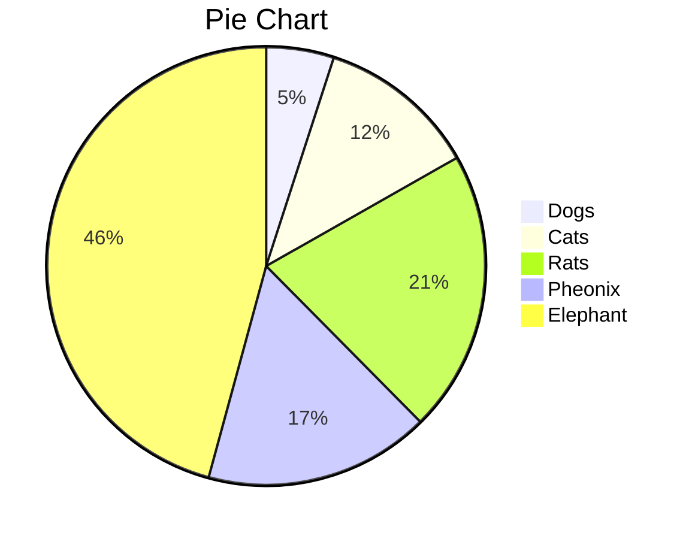
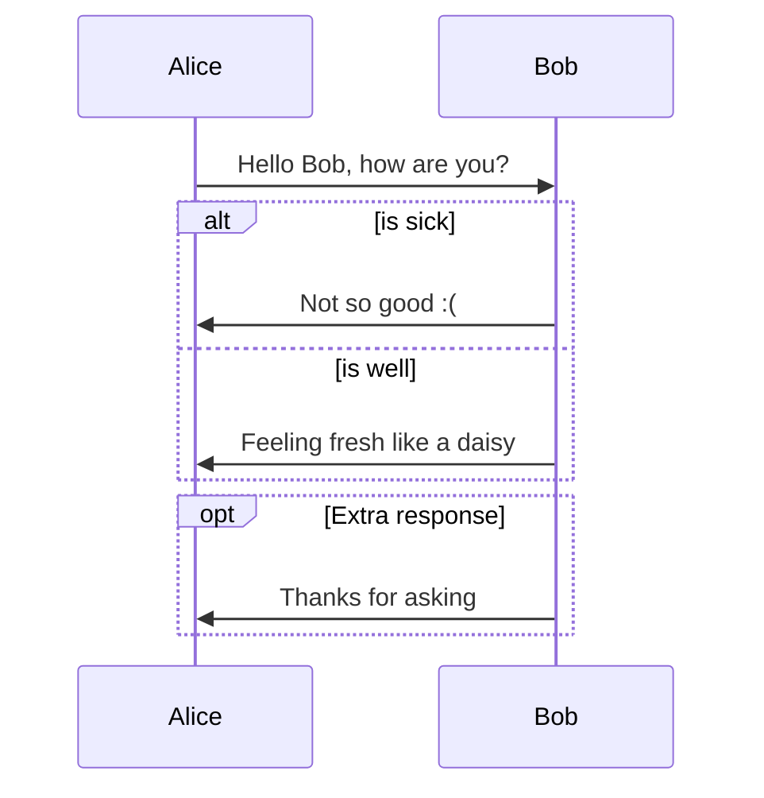
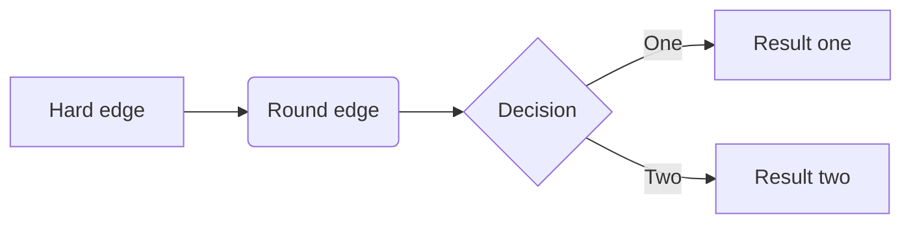

# 読み上げ - ReadLoud
<br>

***IF YOUR ACTIONS INSPIRE OTHERS TO DREAM MORE, LEARN MORE, DO MORE AND BECOME MORE, YOU ARE A LEADER.***
<br>

> Read Loud is the most effective method of teaching reading because with this method we can condition the brain to associate reading as a fun activity. It also creates basic knowledge, builds a collection of words/vocabularies (vocabulary), and provides a good reading role model.
<br>

### Table

| Date         | Version   | Size    | Comment                |
| :----------- | :-------- | :------ | :--------------------- |
| Nov 11, 2018 | v2.14c    | 240 kb  | No irreversible damage |
| Nov 12, 2018 | v2.14c    | 1230 kb | No irreversible damage |
| Nov 13, 2018 | v2.14c    | 12kb    | No irreversible damage |
| Nov 15, 2018 | v1.99 LTS | 4kb     | Irreversible damage    |


### Diagram and Chart

#### Pie Chart



#### Sequence Diagram



#### Flow Chart




### More Codes

```python
# Python program for implementation of Quicksort Sort

# This function takes last element as pivot, places
# the pivot element at its correct position in sorted
# array, and places all smaller (smaller than pivot)
# to left of pivot and all greater elements to right
# of pivot
def partition(arr,low,high):
    i = ( low-1 )         # index of smaller element
    pivot = arr[high]     # pivot

    for j in range(low , high):

        # If current element is smaller than or
        # equal to pivot
        if   arr[j] <= pivot:

            # increment index of smaller element
            i = i+1
            arr[i],arr[j] = arr[j],arr[i]

    arr[i+1],arr[high] = arr[high],arr[i+1]
    return ( i+1 )

# The main function that implements QuickSort
# arr[] --> Array to be sorted,
# low  --> Starting index,
# high  --> Ending index

# Function to do Quick sort
def quickSort(arr,low,high):
    if low < high:

        # pi is partitioning index, arr[p] is now
        # at right place
        pi = partition(arr,low,high)

        # Separately sort elements before
        # partition and after partition
        quickSort(arr, low, pi-1)
        quickSort(arr, pi+1, high)

# Driver code to test above
arr = [10, 7, 8, 9, 1, 5]
n = len(arr)
quickSort(arr,0,n-1)
print ("Sorted array is:")
for i in range(n):
    print ("%d" %arr[i]),

# This code is contributed by Mohit Kumra
```
