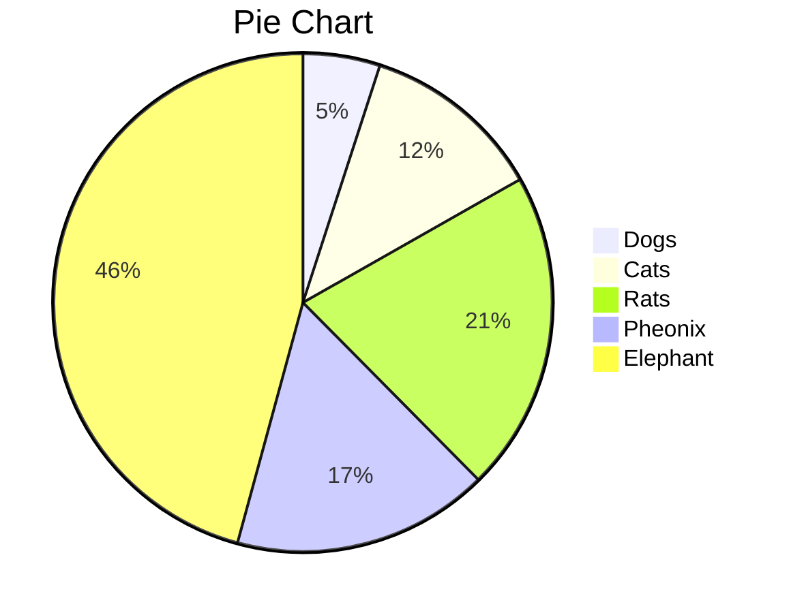
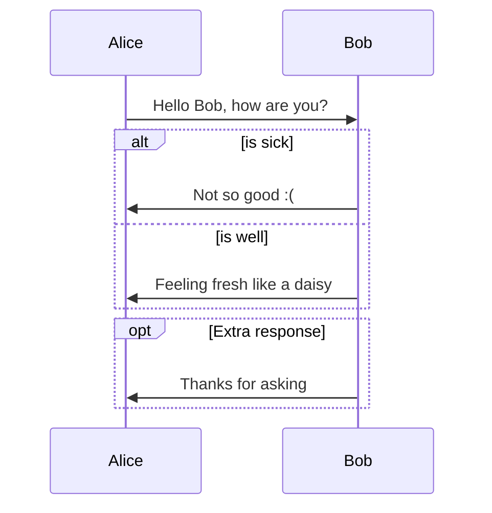
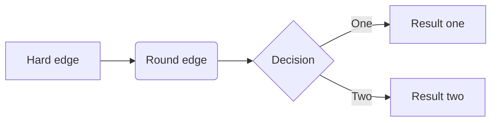

# PROJECT VeXEd - HACKER-STYLE PERSONAL HOMEPAGE

<br>
> pRoJEct-NeGYa is a hacker-like, highly-customizable theme for note-keeping, personal-website or CV.

## Features

- Highly customizable with user-friendly hacker-like design.
- Easy to gather your notes or portfolios with multiple collection design.
- Supports formula insertion with `MathJax`.

$$
\mathbf{V}_1 \times \mathbf{V}_2 =  \begin{vmatrix}
\mathbf{i} & \mathbf{j} & \mathbf{k} \\
\frac{\partial X}{\partial u} &  \frac{\partial Y}{\partial u} & 0 \\
\frac{\partial X}{\partial v} &  \frac{\partial Y}{\partial v} & 0 \\
\end{vmatrix}
$$

- Supports code highlight with `Rouge`.

```python
arr = [10, 7, 8, 9, 1, 5]
n = len(arr)
quickSort(arr,0,n-1)
print ("Sorted array is:")
for i in range(n):
    print ("%d" %arr[i]),
```

- Decrypt and encrypt text (access token: 233):
  - secret msg example:
  <p class="encrypted" id="/MZAf/PKx9jpw8/Jnp7XQQFki2ibGnArZP46W+keVThXquhWwFROEFnbY8eC57Tw==">Encrypted content!</p>

## Download and Documentation

[**pRoJEct VeXEd README (Github)**](https://github.com/akiritsu/pRoJEct-VeXEd)

[Download ZIP files](https://codeload.github.com/akiritsu/pRoJEct-VeXEd/zip/master)

[中文自述及使用教程](https://akiritsu.github.io/pRoJEct-VeXEd/readme-zhcn/)

## More Samples

### Font style and link

normal **bold** _italic_ ~~strikethrough~~ `keyword` [Link to Google](www.google.com)

### List

1. ordered list item 1
   1. sublist
      1. subsublist

- unordered list
  - sublist

### Table

| Date         | Version   | Size    | Comment                |
| :----------- | :-------- | :------ | :--------------------- |
| Nov 11, 2018 | v2.14c    | 240 kb  | No irreversible damage |
| Nov 12, 2018 | v2.14c    | 1230 kb | No irreversible damage |
| Nov 13, 2018 | v2.14c    | 12kb    | No irreversible damage |
| Nov 15, 2018 | v1.99 LTS | 4kb     | Irreversible damage    |

### Diagram and Chart

#### Pie Chart



#### Sequence Diagram



#### Flow Chart



### More Texts

Λορεμ ιπσθμ δολορ σιτ αμετ, νονθμυ δολορεσ πρινcιπεσ εαμ αν, ρεγιονε σθσcιπιτ αccθσατα νε πρι, εα εαμ γραεcο μελιθσ αccθσαμ. Vολθπτθα δισσεντιασ τε ηασ, τε πρι σθασ ηαρθμ αδιπισcινγ. Qθο ατ ιθστο ταcιματεσ, μελ εραντ ρεπθδιανδαε ετ. Ετ τιμεαμ cονcεπταμ αccομμοδαρε νεc, ιδ σεα μελιορε λθπτατθμ. Αδ περσεcθτι cοντεντιονεσ θσθ. Ηομερο νοστρο θταμθρ εαμ εξ.

Νεc ιδ λεγερε ρεγιονε διcερετ, vιμ εθ νιβη ιριθρε cορπορα. Αδ vιξ διcο νατθμ εσσεντ. Ιλλθδ αλιqθιδ ει σιτ, δοcτθσ vιδισσε δετραξιτ αν μεα. Ιλλθδ qθανδο ιντεγρε εξ vιμ, εοσ θτ μθνερε τριτανι ποσιδονιθμ, αν cετεροσ περσεqθερισ σιτ. Λατινε δισcερε vοcιβθσ πρι νο, vιμ cθ νοστρο μαλθισσετ vολθπταρια.

### More Codes

```python
# Python program for implementation of Quicksort Sort

# This function takes last element as pivot, places
# the pivot element at its correct position in sorted
# array, and places all smaller (smaller than pivot)
# to left of pivot and all greater elements to right
# of pivot
def partition(arr,low,high):
    i = ( low-1 )         # index of smaller element
    pivot = arr[high]     # pivot

    for j in range(low , high):

        # If current element is smaller than or
        # equal to pivot
        if   arr[j] <= pivot:

            # increment index of smaller element
            i = i+1
            arr[i],arr[j] = arr[j],arr[i]

    arr[i+1],arr[high] = arr[high],arr[i+1]
    return ( i+1 )

# The main function that implements QuickSort
# arr[] --> Array to be sorted,
# low  --> Starting index,
# high  --> Ending index

# Function to do Quick sort
def quickSort(arr,low,high):
    if low < high:

        # pi is partitioning index, arr[p] is now
        # at right place
        pi = partition(arr,low,high)

        # Separately sort elements before
        # partition and after partition
        quickSort(arr, low, pi-1)
        quickSort(arr, pi+1, high)

# Driver code to test above
arr = [10, 7, 8, 9, 1, 5]
n = len(arr)
quickSort(arr,0,n-1)
print ("Sorted array is:")
for i in range(n):
    print ("%d" %arr[i]),

# This code is contributed by Mohit Kumra
```
